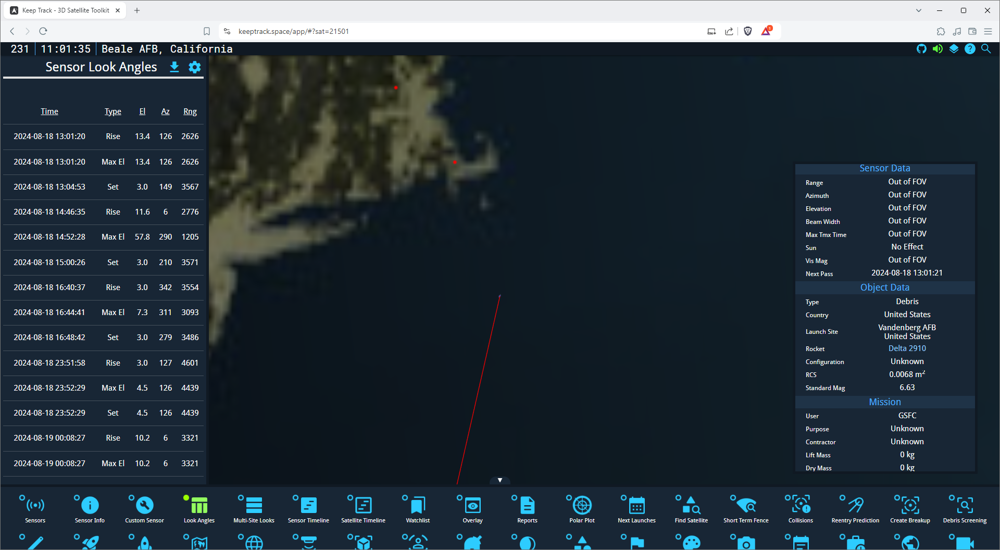
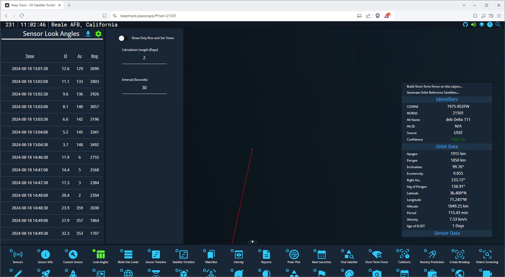

import { Steps } from '@astrojs/starlight/components';
import { Aside } from '@astrojs/starlight/components';

Now that you know how to pick a sensor, let's learn how to calculate look angles between a sensor and a satellite. This will help you determine when and where a satellite will be visible from a specific ground station.

## What are Look Angles?

Look angles consist of four main components:

- **Time**: The moment when the satellite's position is calculated
- **Azimuth (Az)**: The horizontal angle measured clockwise from true north (0-360 degrees)
- **Elevation (El)**: The vertical angle above the horizon (0-90 degrees)
- **Range**: The distance between the sensor and the satellite (usually in kilometers)

There is also one optional component:

- **Type**: The type of entry (e.g., rise, set, or maximum elevation)

<Aside>
  In optical tracking systems, right ascension (RA) and declination (Dec) are often used instead of azimuth and elevation.
  There has not been a lot of interest from the community to implement RA and Dec in KeepTrack, but it is possible in the future.
</Aside>

## Using the Look Angles Plugin

<Steps>
1. Select a Sensor and Satellite:
   - Choose a sensor using the Sensor List (as learned in the previous guide)
   - Select a satellite using the search function (covered in the "Find a Satellite" guide)

2. Open the Look Angles Plugin:
   - Find the "Look Angles" icon in the bottom menu
   - Click on this icon to open the Look Angles side menu

3. View Look Angle Data:
   - The side menu will display a table with look angle information
   - Each row shows the Time (UTC), Type of entry, Azimuth, Elevation, and Range

   

4. Interpret the Data:
   - **Rise Time**: When the satellite becomes visible
   - **Set Time**: When the satellite disappears from view
   - **Max Elevation**: The highest point of the pass, best time for observation

5. Adjust Calculation Settings (Optional):
   - Click the settings icon (gear) in the Look Angles menu
   - You can modify:
     - Calculation Length (in days)
     - Interval (in seconds) between each calculation
     - Toggle "Show Only Rise and Set Times" for a condensed view
   - You have to click somewhere else or press Enter to apply the changes

   
</Steps>

<Aside type="tip">
  The "Show Only Rise and Set Times" option is great for quickly identifying when the satellite will become visible or disappear from the sensor's view.
</Aside>

## Example: Calculating Look Angles for the ISS

Let's calculate look angles for the International Space Station (ISS) from the Eglin radar:

<Steps>
1. Select the Eglin radar sensor (as shown in the previous guide)
2. Search for and select the ISS (ZARYA) satellite
3. Open the Look Angles plugin
4. Observe the look angle data in the table
5. Look for times when the Range is less than 2000 km
6. If no passes are within 2000 km, try adjusting the calculation length to 4 days
</Steps>

<Aside>
  Remember that satellites in Low Earth Orbit (LEO) like the ISS move quickly, so visibility windows are usually short (5-10 minutes).
</Aside>

## Practice Exercise

Try calculating look angles for these scenarios:

<Steps>
1. A GPS satellite (e.g., GPS IIF-1) from the NESS (GEODSS) sensor in Diego Garcia
2. The Hubble Space Telescope from Fylingdales (SSPAR) in the UK
3. A geostationary satellite (e.g., GOES 16) from Millstone (Haystack) in Massachusetts
</Steps>

## Exporting Look Angle Data

To save your look angle calculations:

<Steps>
1. Click the download icon in the Look Angles menu
2. The data will be saved as a CSV file, which you can open in spreadsheet software for further analysis
</Steps>

By mastering look angle calculations, you're taking a big step in understanding satellite visibility and tracking. This skill is crucial for planning observations, predicting satellite passes, and comprehending the capabilities of different ground stations.