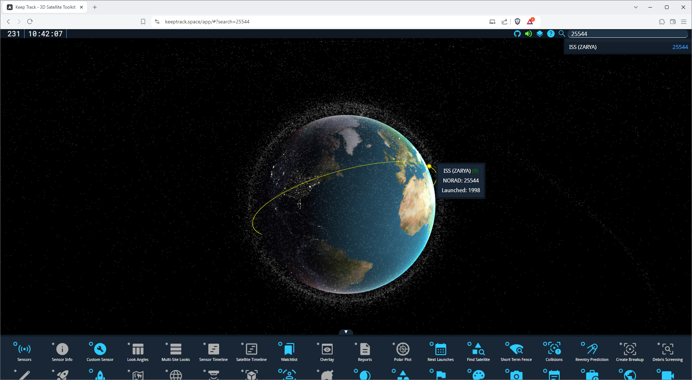
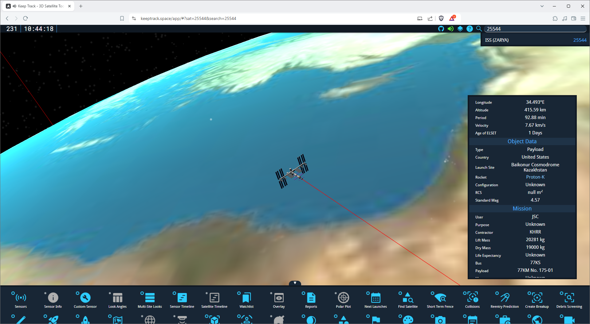

import { Steps } from '@astrojs/starlight/components';
import { Aside } from '@astrojs/starlight/components';

Now that you're familiar with the basics of KeepTrack.Space, let's learn how to find a specific satellite. We'll use the International Space Station (ISS) as an example.

<Aside type="tip">
  While selected, the camera will follow the satellite as it moves along its orbit.
</Aside>

<Steps>

1. Open the search bar:
   - Click the search icon in the top menu, or
   - Use the keyboard shortcut `Shift + F`

2. Enter search terms:
   - Type "ISS" or "25544" (the NORAD ID for the ISS)
   - You should see results appear as you type

   

3. Select the satellite:
   - Click on the ISS in the search results
   - The view will center on the ISS

4. Explore the satellite:
   - Use the mouse to rotate the view:
     - Left-click and drag to orbit around the ISS
     - Middle-click and drag to adjust the camera angle
   - Zoom in or out:
     - Use the scroll wheel, or
     - Use the `Numpad +` and `Numpad -` keys

5. View satellite information:
   - Look for the Satellite Info Box, usually in the bottom-right corner
   - This box displays detailed information about the ISS

   

</Steps>

<Aside title="Fun Fact">
  When the ISS is selected you can actually hear audio from the astronauts on board. Keep your volume up!
</Aside>

## Example: Finding a Specific Satellite

Let's try finding another satellite, like the Hubble Space Telescope:

1. Open the search bar (`Shift + F`)
2. Type "Hubble" or its NORAD ID "20580"
3. Click on the Hubble Space Telescope in the search results
4. Explore its orbit and information using the mouse controls and info box

<Aside type="caution">
  Not everyone agrees on the name of a satellite! The Hubble Space Telescope is also known as "HST", but KeepTrack lets you search by either name.
</Aside>

## Practice Exercise

Try finding these satellites on your own:

1. GPS IIR-11 (NORAD ID: 28190)
2. GOES 16 (NORAD ID: 41866)
3. Tianhe (NORAD ID: 48274)

Remember, you can search by name or NORAD ID. Use the mouse controls to explore each satellite's orbit and position relative to Earth.

<Aside>
  If you're having trouble locating a satellite, make sure you've spelled the name correctly or entered the right NORAD ID. Some satellites might also be temporarily hidden behind the Earth, so try adjusting the time using the clock in the top menu.
</Aside>

Now that you know how to find satellites, you can explore the vast array of objects tracked by KeepTrack.Space. Happy satellite hunting!