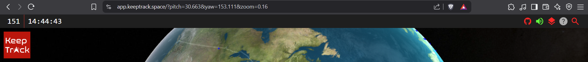
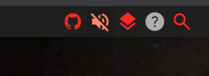
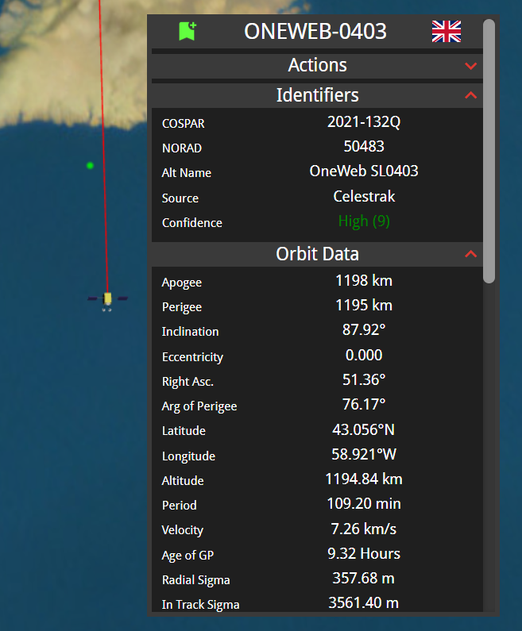

import { Tabs, TabItem } from '@astrojs/starlight/components';
import { Steps } from '@astrojs/starlight/components';
import { Aside } from '@astrojs/starlight/components';

This guide provides a detailed overview of the KeepTrack user interface, explaining each component and its functionality.

## Top Menu Bar

The top menu bar contains essential information and quick-access controls. It is located at the top of the screen.

### Ordinal Date / JDay

Displays the current Ordinal Date (sometimes referred to as the Julian Day, or JDay). It is the number of days since the start of the year. This is read-only and clicking it will not do anything.

<Aside>
   This is not the same as astronomer's [Julian Date](https://en.wikipedia.org/wiki/Julian_day), which is the number of days since January 1, 4713 BC.
</Aside>

### Clock

Shows the current UTC time of the simulation. By default it is set to the current time, but users can adjust it by clicking on it and changing the date and time with the popup menu.

### Sound Toggle

Allows users to turn on/off sound effects within the application.

### Legend/Filter

Opens a panel displaying the color-coding legend for various object types and provides filtering options.

### Help Button

This will toggle a popup with some basic information about the current open side menu.
For example, if the Sensor List side menu is open, the help popup will provide information about the Sensor List plugin.
 
It will not provide information if there is no side menu open.

<Aside type="tip" title="Keyboard Shortcut">
  Pressing `shift + F1` will open the help popup.
</Aside>

### Search Bar

Enables users to search for specific satellites, debris, or other space objects. There is a minimum of 3 characters required to search. Results will be displayed in the search dropdown. Users can search using:
<Steps>
1. NORAD ID (e.g., 25544)
2. Object name (e.g., ISS)
3. International Designator (e.g., 1998-067A)
4. Launch Vehicle (e.g., Falcon 9)
</Steps>

<Aside type="tip" title="Keyboard Shortcut">
  Pressing `Shift + F` will open and focus on the search bar.
</Aside>

## Side Menu (Left)

The left side menu provides access to various plugins and settings. To open the side menu you need to select an icon from [the bottom icon drawer](#bottom-menu).

### Various Plugins Overview

There are numerous plugins available in the side menu, each providing specific functionalities. Here are some examples:

- **Sensor List**: Manage and select different ground-based sensors.
- **Look Angles**: Calculate and display look angles between a sensor and a satellite.
- **New Launch**: Create a new satellite launch based on a current object.
- **Breakup**: Generate a breakup event for a selected satellite.
- **Color Schemes**: Select different color schemes for the application interface.

### Settings Sub-Menu

Accessed through a gear icon, this sub-menu allows users to configure certain plugin-specific settings.

## Bottom Menu

The bottom menu provides quick access to various tools and views. Each icon represents a different feature or plugin.

<Aside>
  You can scroll down to see more icons if they are not all visible.
</Aside>
<Aside type="tip" title="Keyboard Shortcut">
  Pressing `Shift + B` will toggle the bottom menu.
</Aside>

### Bottom Menu Categories

The bottom menu includes category filters in the bottom left corner to help organize and find specific tools. The available categories are:

- **Basic**: Essential tools for everyday use (e.g., search, sensor selection, satellite tracking)
- **Advanced**: More sophisticated features for experienced users (e.g., look angles, polar plots, analysis tools)
- **Analysis**: Data analysis and reporting tools (e.g., collision analysis, debris screening, reports)
- **Experimental**: Cutting-edge features that are still in development or testing
- **Settings**: Configuration and customization options
- **All**: Shows all available plugins regardless of category

<Aside type="tip">
  Use the category filters to quickly find the tools you need without scrolling through all available options.
</Aside>

## Satellite Info Box

Provides detailed information about a selected satellite or space object. It is only visible when a satellite or object is selected.

### Top Links

Quick links to various actions related to the selected object. Here are a few examples:

- Find all objects from the same launch
- Find all objects near the same orbit
- Find all objects near the selected object
- Draw a line from the selected object to the Sun
- Draw lines to all sensors with line of sight

### Orbit Info

Displays key orbital parameters such as:

- Inclination
- Eccentricity
- Period
- Apogee/Perigee

### Object Data

Shows general information about the selected object such as:

- Launch date
- Country of origin
- Radar Cross Section (RCS)

### Mission

Provides additional details about the selected object's mission, including:

- Purpose
- User
- Shape
- Mass

### Draggable

The menu can be dragged around the screen for better visibility.

<Aside>
  Right clicking on the menu will reset its position back to the bottom right corner.
</Aside>