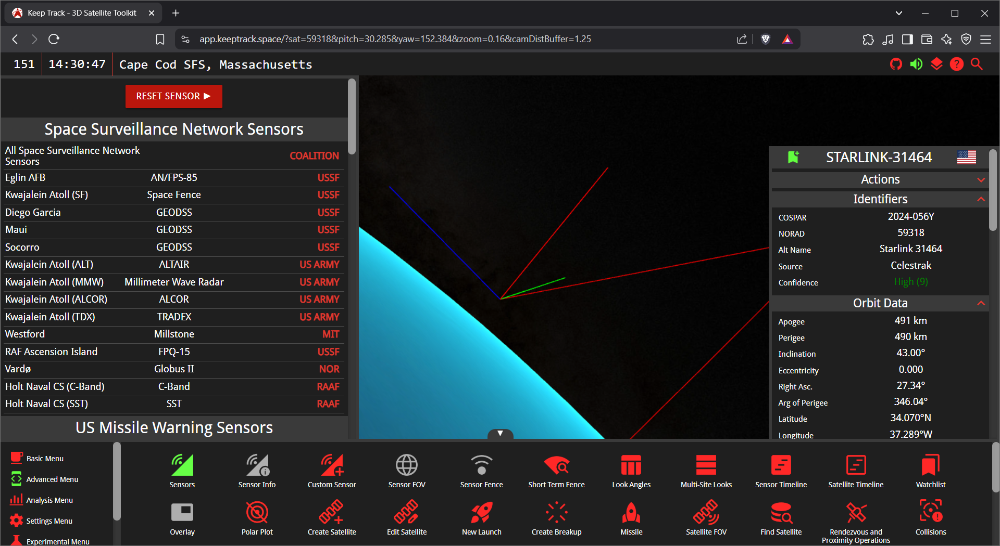

import { Steps } from '@astrojs/starlight/components';
import { Aside } from '@astrojs/starlight/components';
import { LinkCard, CardGrid } from '@astrojs/starlight/components';

Welcome to the KeepTrack.Space documentation! This guide will help you understand the basics of our platform and how it can make managing your astrodynamics projects easier.

## What is KeepTrack.Space?

KeepTrack.Space is a user-friendly platform designed for anyone interested in astrodynamics, from beginners to professionals. Whether you're studying orbital mechanics, working on research, or just curious about space, KeepTrack.Space has tools to help you track and analyze satellite data.

## Key Features

- **Live Orbital Tracking** Easily follow and visualize satellite orbits as they happen.
- **Personalized Dashboards** Set up your dashboard to show the information that matters most to you.
- **Easy Data Integration** Combine data from different sources, like satellite telemetry and ground stations, without any hassle.
- **Simple Simulation Tools** Run basic simulations to see how satellites move and interact in space.

## What You Can Do With KeepTrack

Here are some practical things you can accomplish with KeepTrack:

- **Track the International Space Station (ISS)** and see when it will pass over your location
- **Visualize satellite constellations** like GPS, Starlink, or scientific missions
- **Calculate when satellites are visible** from ground stations around the world
- **Simulate missile trajectories** for educational or research purposes
- **Create polar plots** to plan satellite observations
- **Analyze orbital debris** and potential collision risks
- **Generate reports** with orbital data and look angles
- **Take high-resolution screenshots** of your visualizations for presentations

## Who Can Use KeepTrack.Space?

KeepTrack.Space is great for:
- **Students and Teachers** A perfect tool for learning and teaching about space and satellite movement.
- **Researchers** Use it to dive deeper into your studies or experiments.
- **Space Enthusiasts** Anyone who loves space and wants to explore orbital mechanics can enjoy this platform.

## Getting Started

One of the best things about KeepTrack.Space is how easy it is to get started. Here is all you have to do to get going for the first time:
<Steps>
1. <LinkCard
    title="Load the KeepTrack App"
    description="Visit keeptrack.space/app/ to load the 3D app."
    href="https://keeptrack.space/app/"
   />
3. ~Setup the time and date.~
     
    Date and time are set automatically.
4. ~Load the satellites you need individually.~
     
    Satellites are loaded automatically.
5. ~Create real sensors by hand~
     
    Sensors are created automatically.
</Steps>

<Aside type="tip">
    KeepTrack takes a unique approach of giving you everything by default and letting you remove/modify from there. You still have complete control, but can often get what you need in only a few clicks using the defaults.
</Aside>

## Support and Community

We're here to help! If you need assistance, take a look at our [Github page](https://github.com/thkruz/keeptrack.space) or [reach out to us directly](mailto:admin@keeptrack.space). We're always happy to help you get the most out of KeepTrack.Space.

## Contributing to KeepTrack.Space

KeepTrack.Space is open-source, and we love getting help from the community. If you're interested in contributing, visit our GitHub page to get started.

## Conclusion

KeepTrack.Space makes it easy to explore and understand astrodynamics. Whether you're learning, researching, or just exploring, our platform provides the tools you need to succeed in a fun and accessible way.